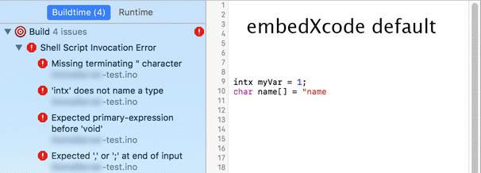
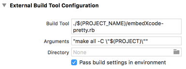

# embedXcode-pretty

A tool to report
[embedXcode](http://embedxcode.weebly.com)'s compilation issues directly in code editing window.

## How to

### 1. Install
Download _embedXcode-pretty.rb_ and put it to a root folder of your _embedXcode_ project (i.e. where _main.cpp_ file is located)

### 2. Setup project
Modify each Target's "External Build Tool Configuration" as follows:

- Build tool: `./$(PROJECT_NAME)/embedXcode-pretty.rb`
- Arguments: 
	1. Prefix original command with `make `
	2. Escape original quotes and enclose whole original value with quotes (e.g `"make all -C \"$(PROJECT)\""`)
    - The original arguments are now passed as single argument to _embedXcode-pretty.rb_

### 3. Use
Same as before 😎

## How it works
_embedXcode-pretty.rb_ does following:

- Executes original _embedXcode_ `make` command
- Captures output
- Transforms errors and warnings generated by compiler to Xcode compatible format
- Xcode does the rest and highlights issues in code editor

## Disclaimer
I don't have any relationship with the _embedXcode_ project. It is amazing and you should check it out at
[http://embedxcode.weebly.com](http://embedxcode.weebly.com).

_embedXcode-pretty_ was tested with Arduino Uno. I am not sure how/if it works with other boards.

## License

[MIT licensed.](LICENSE)

## About

Developed by [Lukas Kukacka](http://lukaskukacka.com).